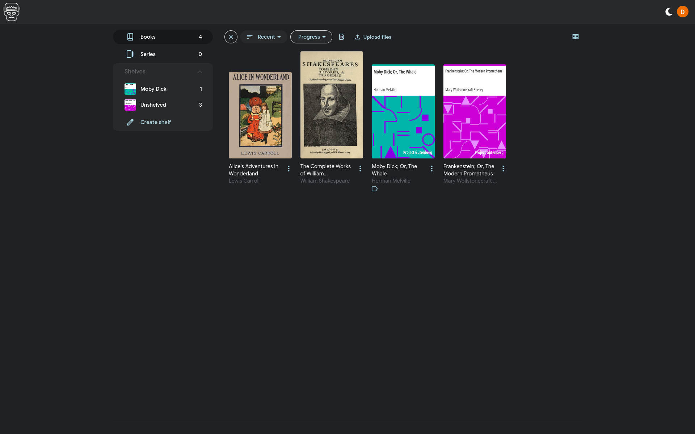
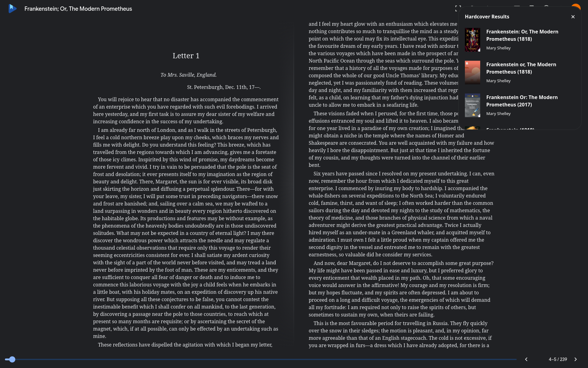
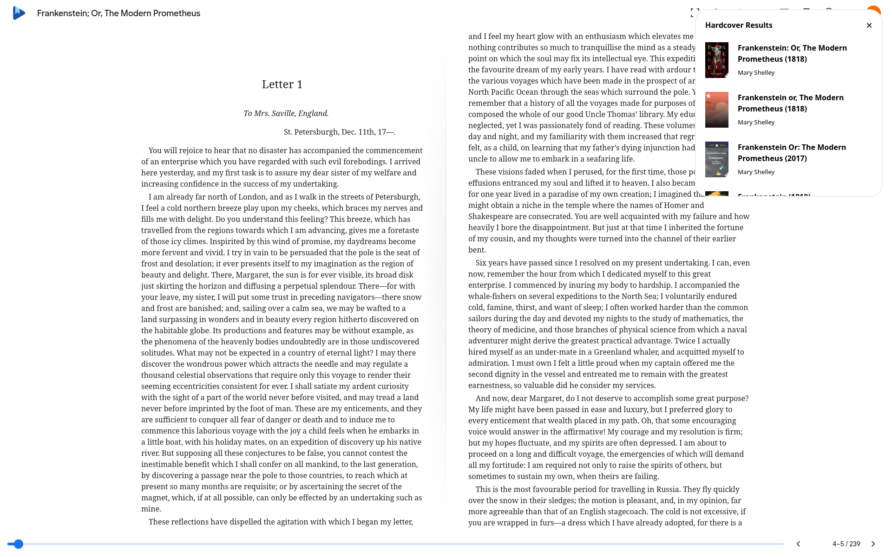

# Frankenstein
#### Unofficial Google Play Books client for desktop

> [!WARNING]
> Frankenstein has only been tested on Linux using uploaded books. It should still work on other platforms too (hopefully).

## Features
- All Google Play Books features
- Light and dark mode (syncs with the reader)
- Sync progress with Hardcover

Upcoming features:
- Unlinking books from Hardcover

## Screenshots

## Hardcover integration
Frankenstein is setup to automatically track your progress with Hardcover.
1. Head over to https://hardcover.app/account/api
2. Copy your token (without the "Bearer" part)
3. Set the HARDCOVER_TOKEN environment variable to the token you just copied

To link a book with Hardcover:
1. Open the book you want to link
2. In the top right, select one of the Hardcover results
