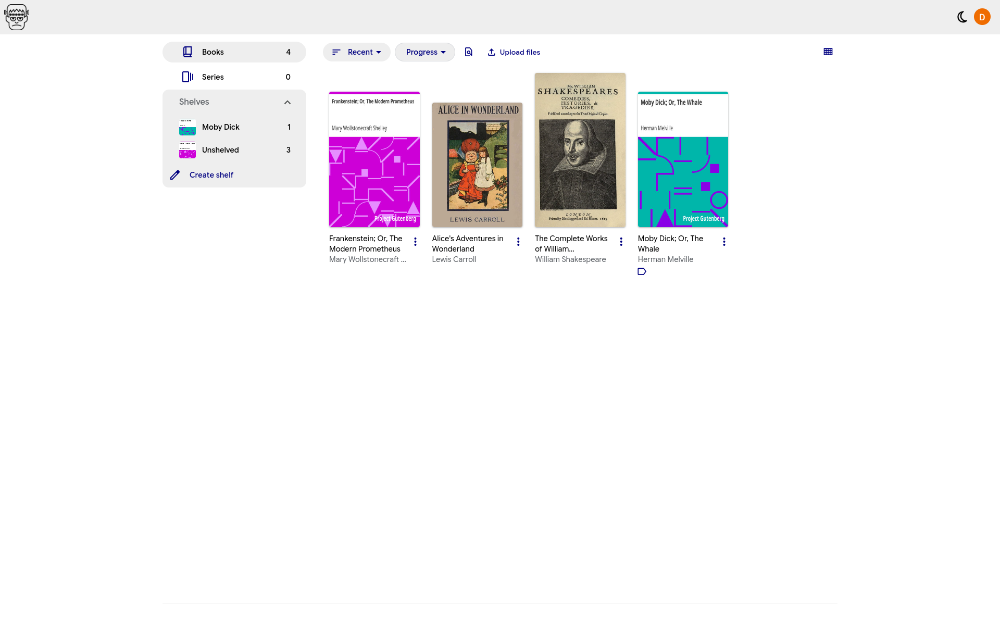

# Frankenstein
**Unofficial Google Play Books client for desktop**

[](https://github.com/crxssed7/play-books-frankenstein/releases/latest)

> [!WARNING]
> Frankenstein has only been tested on Linux using uploaded books. It should still work on other platforms too (hopefully).

## Features
- All Google Play Books features
- Light and dark mode (syncs with the reader)
- Sync progress with Hardcover

Upcoming features:
- Unlinking books from Hardcover
- Basic theming
- Extensions
- Automatic progress tracking toggle
- Anything else I find amusing :)

## Screenshots





## Hardcover integration
Frankenstein is setup to automatically track your progress with Hardcover.
1. Head over to https://hardcover.app/account/api
2. Copy your token (without the "Bearer" part)
3. In Frankenstein, click the gear icon in the top right
4. Set the Hardcover token setting to the token you just copied
5. Restart Frankenstein

To link a book with Hardcover:
1. Open the book you want to link
2. In the top right, select one of the Hardcover results

## Development
Pull requests are welcome! Running the project is quite simple too:
1. Ensure you have Python 3 (https://www.python.org/) and Pipenv (https://pipenv.pypa.io/) installed
2. Clone this repo and `cd` into it:
```bash
git clone https://github.com/crxssed7/play-books-frankenstein
cd play-books-frankenstein
```
3. Initialize a virtual environment and activate it:
```bash
python -m venv .venv
source .venv/bin/activate
```
4. Install dependencies:
```bash
pipenv install
```
5. Run `python main.py`
6. (OPTIONAL) You can build a binary with `pyinstaller main.spec`. The output will be in `dist/`
